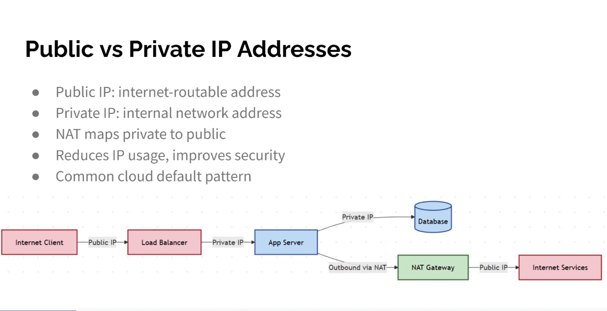

Public vs Private IP Addresses
● Public IP: internet-routable address
● Private IP: internal network address
● NAT maps private to public
● Reduces IP usage, improves security
● Common cloud default pattern

