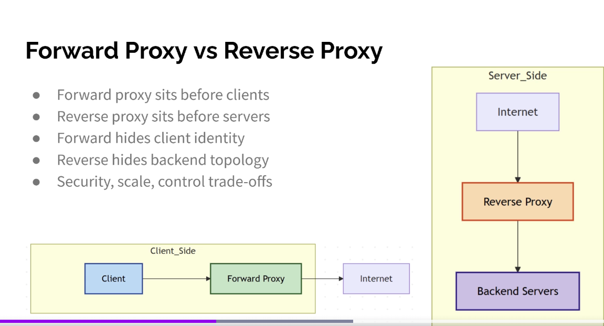

Forward Proxy vs Reverse Proxy
● Forward proxy sits before clients
● Reverse proxy sits before servers
● Forward hides client identity
● Reverse hides backend topology
● Security, scale, control trade-offs

