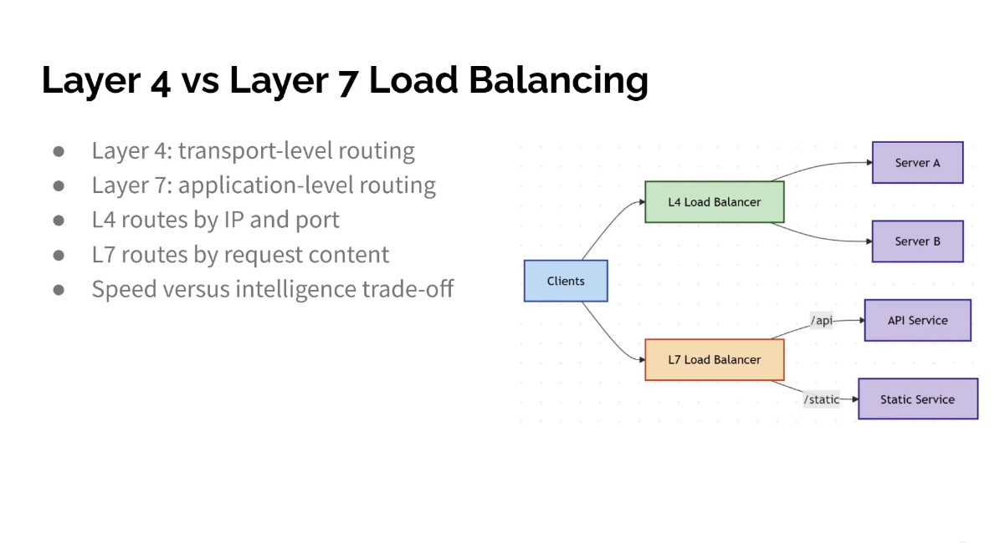

Layer 4 vs Layer 7 Load Balancing
● Layer 4: transport-level routing
● Layer 7: application-level routing
● L4 routes by IP and port
● L7 routes by request content
● Speed versus intelligence trade-off

