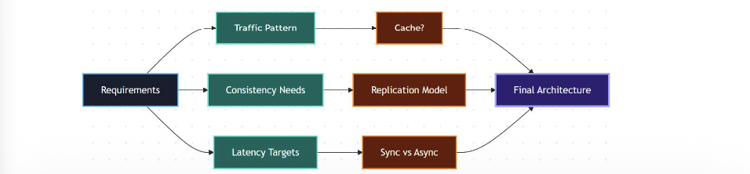

What Is a Universal System Design Blueprint
● Systems are component choices
● Same building blocks everywhere
● Requirements drive selections
● Trade-offs, not perfect designs
● Structured thinking framework

