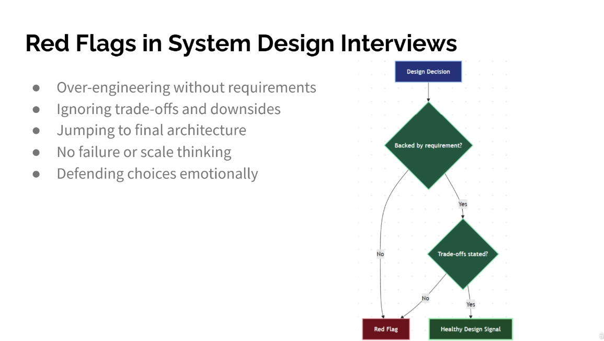

Red Flags in System Design Interviews
● Over-engineering without requirements
● Ignoring trade-offs and downsides
● Jumping to final architecture
● No failure or scale thinking
● Defending choices emotionally

