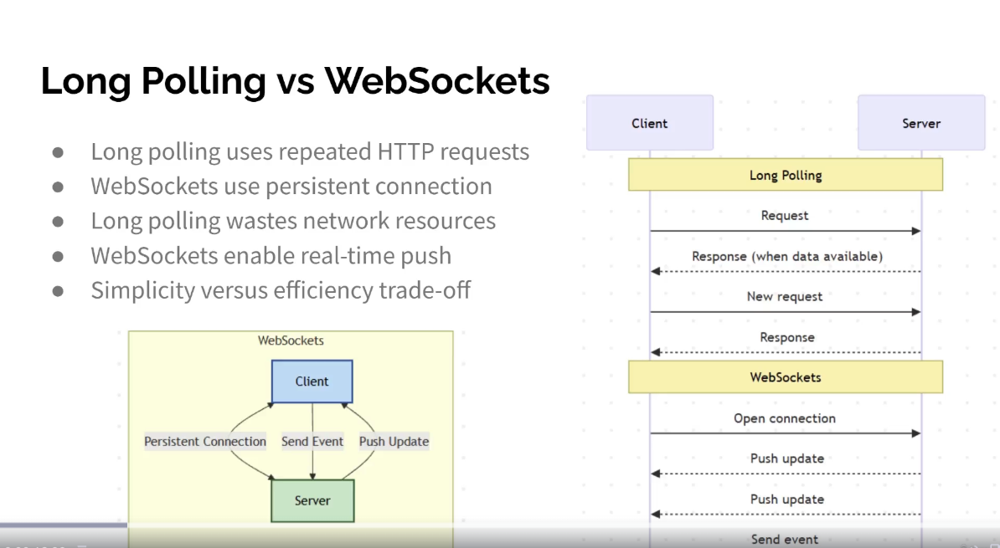

Long Polling vs WebSockets
● Long polling uses repeated HTTP requests
● WebSockets use persistent connection
● Long polling wastes network resources
● WebSockets enable real-time push
● Simplicity versus efficiency trade-off

