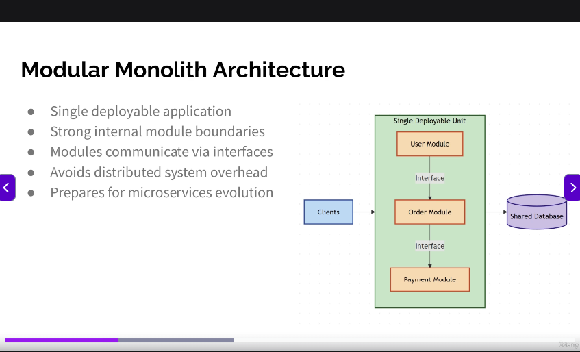

Modular Monolith Architecture
● Single deployable application
● Strong internal module boundaries
● Modules communicate via interfaces
● Avoids distributed system overhead
● Prepares for microservices evolution

