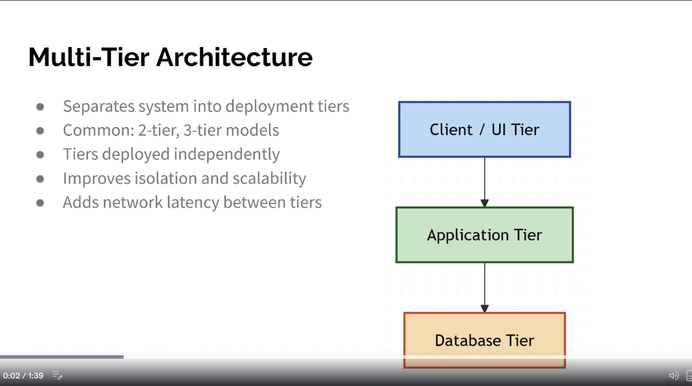

Multi-Tier Architecture
● Separates system into deployment tiers
● Common: 2-tier, 3-tier models
● Tiers deployed independently
● Improves isolation and scalability
● Adds network latency between tiers

