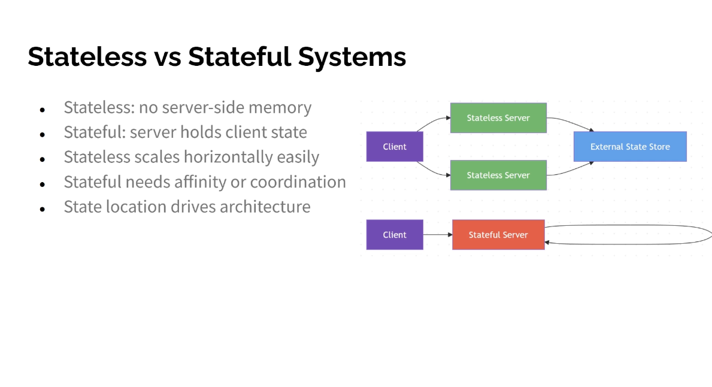

Stateless vs Stateful Systems
● Stateless: no server-side memory
● Stateful: server holds client state
● Stateless scales horizontally easily
● Stateful needs affinity or coordination
● State location drives architecture

