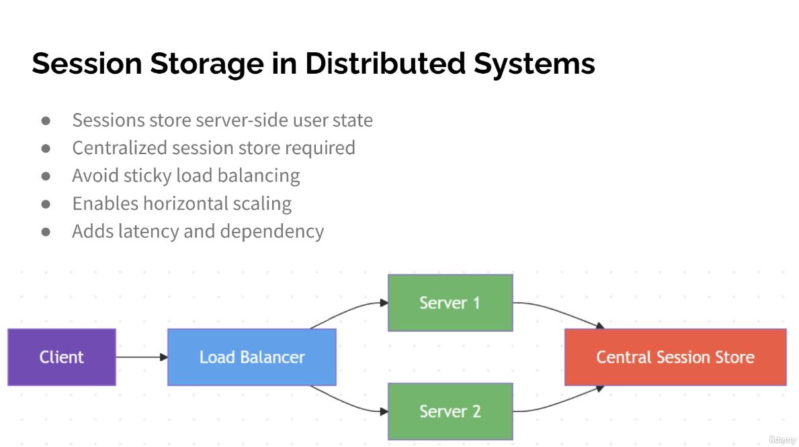

Session Storage in Distributed Systems
● Sessions store server-side user state
● Centralized session store required
● Avoid sticky load balancing
● Enables horizontal scaling
● Adds latency and dependency

