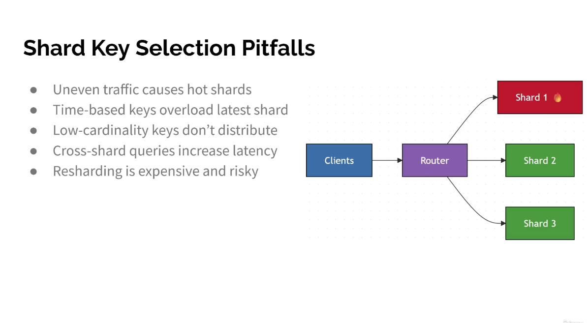

Shard Key Selection Pitfalls
● Uneven traffic causes hot shards
● Time-based keys overload latest shard
● Low-cardinality keys donʼt distribute
● Cross-shard queries increase latency
● Resharding is expensive and risky

