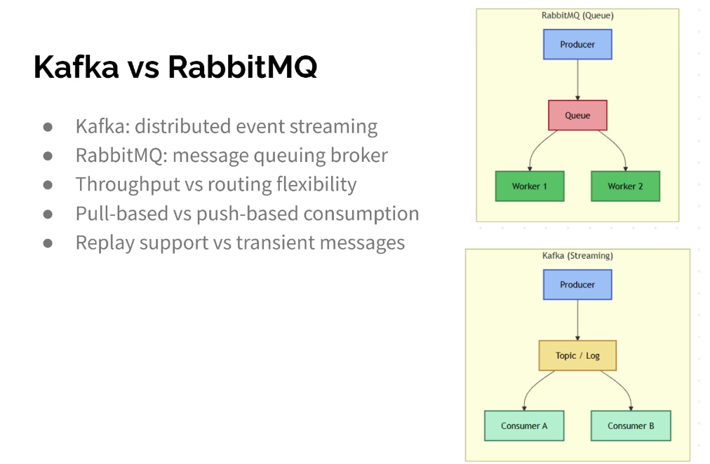

Kafka vs RabbitMQ
● Kafka: distributed event streaming
● RabbitMQ: message queuing broker
● Throughput vs routing flexibility
● Pull-based vs push-based consumption
● Replay support vs transient messages

