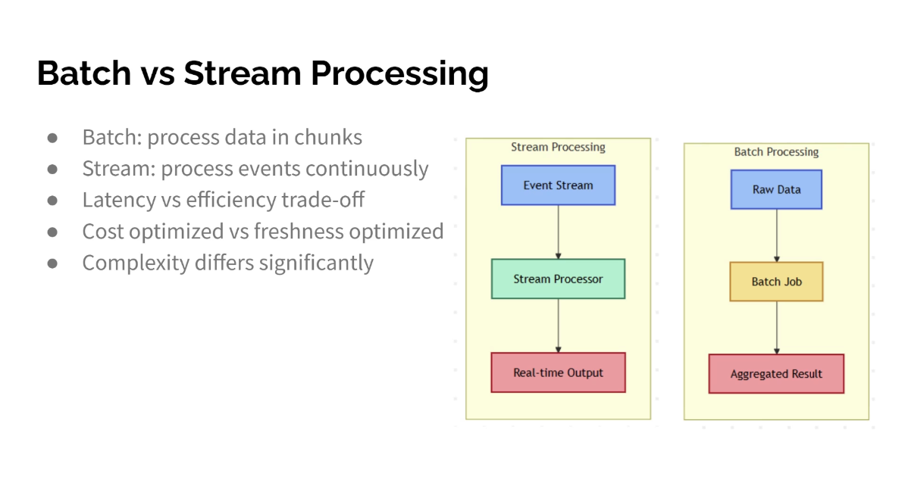

Batch vs Stream Processing
● Batch: process data in chunks
● Stream: process events continuously
● Latency vs efficiency trade-off
● Cost optimized vs freshness optimized
● Complexity differs significantly

