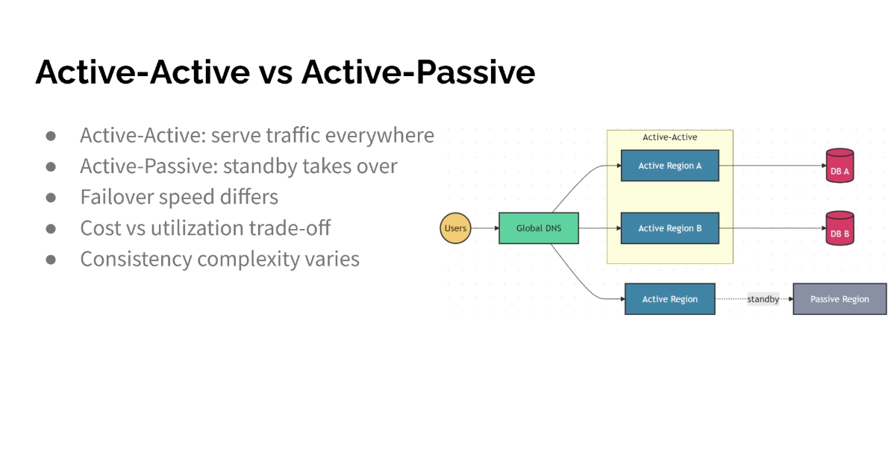

Active-Active vs Active-Passive
● Active-Active: serve traffic everywhere
● Active-Passive: standby takes over
● Failover speed differs
● Cost vs utilization trade-off
● Consistency complexity varies

