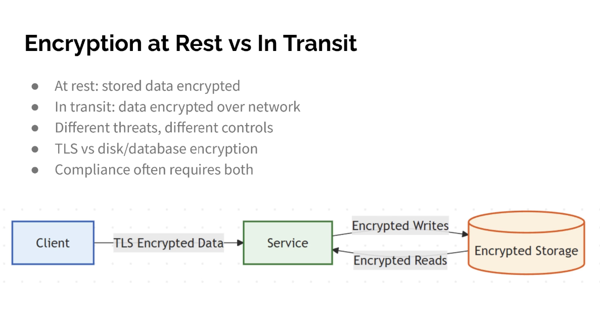

Encryption at Rest vs In Transit
● At rest: stored data encrypted
● In transit: data encrypted over network
● Different threats, different controls
● TLS vs disk/database encryption
● Compliance often requires both

