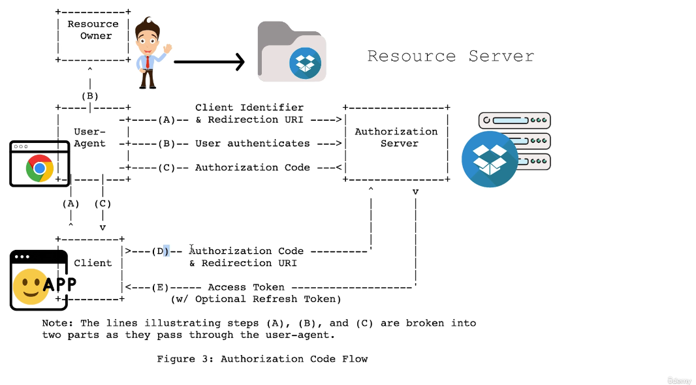

CODESANDBOX + GITHUB OAUTH2 AUTHORIZATION CODE FLOW

=====================================================
WHO IS WHO IN THE DIAGRAM
=====================================================

+----------------+
| Resource Owner |
+----------------+
        ^
        |
       YOU

Resource Owner = You

- Your GitHub account
- Your profile
- Your email
- Your repositories

-----------------------------------------------------

+------------+
| User-Agent |
+------------+
      ^
      |
   Chrome

User-Agent = Your Browser

- Chrome
- Firefox
- Safari
- Edge

The browser transports redirects between
CodeSandbox and GitHub.

-----------------------------------------------------

+--------+
| Client |
+--------+
     ^
     |
CodeSandbox

Client = CodeSandbox

- The application that wants access to your GitHub data
- It starts the OAuth flow
- It receives the authorization code
- It exchanges the code for an access token

-----------------------------------------------------

+----------------------+
| Authorization Server |
+----------------------+
           ^
           |
      GitHub OAuth

Authorization Server = GitHub OAuth

Responsibilities:

- Shows login page
- Verifies your password
- Shows consent screen
- Issues authorization codes
- Issues access tokens

Examples:

github.com/login/oauth/authorize
github.com/login/oauth/access_token

-----------------------------------------------------

+----------------+
| Resource Server|
+----------------+
        ^
        |
     GitHub API

Resource Server = GitHub API

Contains actual resources:

- Your profile
- Your email
- Your repositories
- Your organizations

Examples:

api.github.com/user
api.github.com/user/emails
api.github.com/user/repos

=====================================================
FULL MAPPING
=====================================================

        YOU
(Resource Owner)
        |
        v

      Chrome
    (User-Agent)

        |
        |

   CodeSandbox
      (Client)

        |
        |

    GitHub OAuth
(Authorization Server)

        |
        |

    GitHub API
  (Resource Server)

=====================================================
STEP-BY-STEP FLOW
=====================================================

1. User clicks

   "Continue with GitHub"

   on CodeSandbox.

-----------------------------------------------------

2. Browser redirects to GitHub

CodeSandbox sends:

client_id
redirect_uri

Example:

https://github.com/login/oauth/authorize
?client_id=abc123
&redirect_uri=https://codesandbox.io/callback

-----------------------------------------------------

3. User authenticates

GitHub shows:

Username
Password

User logs in.

This is:

AUTHENTICATION

Question being answered:

"Who are you?"

-----------------------------------------------------

4. User authorizes

GitHub shows:

Authorize CodeSandbox

✓ Read your profile
✓ Read your email

[Cancel]
[Authorize]

User clicks:

Authorize

This is:

AUTHORIZATION

Question being answered:

"What permissions are you granting?"

-----------------------------------------------------

5. GitHub returns Authorization Code

Browser is redirected back:

https://codesandbox.io/callback
?code=abc123

Browser receives:

Authorization Code

NOT access token.

-----------------------------------------------------

6. CodeSandbox exchanges code for token

CodeSandbox backend sends:

POST /login/oauth/access_token

with:

client_id
client_secret
authorization_code

-----------------------------------------------------

7. GitHub returns Access Token

Example:

{
  "access_token": "gho_xxxxxxxxx"
}

to CodeSandbox backend.

-----------------------------------------------------

8. CodeSandbox calls GitHub API

Example:

GET https://api.github.com/user

Authorization:
Bearer gho_xxxxxxxxx

-----------------------------------------------------

9. GitHub API returns user data

Example:

{
  "id": 12345,
  "login": "bohdan",
  "email": "bohdan@example.com",
  "avatar_url": "..."
}

-----------------------------------------------------

10. CodeSandbox creates its own session

CodeSandbox now knows:

- Who you are
- Your GitHub username
- Your email

It creates:

- User account
- Session
- Cookie or JWT

and logs you in.

=====================================================
WHY DOES CODESANDBOX NEED GITHUB API?
=====================================================

After authentication GitHub only knows:

"This user logged in successfully."

CodeSandbox still needs:

- Username
- Email
- Avatar
- GitHub ID

To get that information it calls:

GET /user

using the access token.

Without GitHub API:

CodeSandbox would not know:

- Who the user is
- What email to use
- Which account to create

=====================================================
AUTHENTICATION VS AUTHORIZATION
=====================================================

Authentication:

GitHub asks:

"Who are you?"

User provides:

Username + Password

Result:

Identity verified.

Authorization:

GitHub asks:

"Do you allow CodeSandbox to access
your GitHub data?"

User clicks:

Authorize

Result:

Permissions granted.

Easy rule:

Authentication = Who are you?

Authorization = What are you allowed to do?

=====================================================
INTERVIEW ANSWER
=====================================================

In the CodeSandbox + GitHub login flow:

- User = Resource Owner
- Browser = User-Agent
- CodeSandbox = OAuth Client
- GitHub OAuth = Authorization Server
- GitHub API = Resource Server

The user first authenticates with GitHub by
proving their identity.

Then the user authorizes CodeSandbox to access
specific GitHub resources (such as profile and email).

GitHub returns an authorization code to
CodeSandbox, which exchanges it for an access token.

CodeSandbox uses the access token to call GitHub APIs,
retrieve user information, and create its own session.